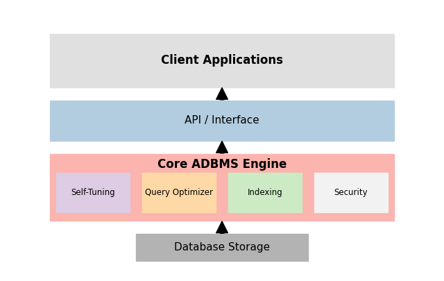
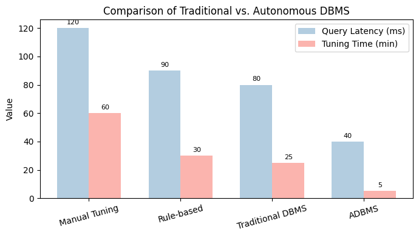

# AI-Driven Autonomous Database Management System (ADBMS)

This project implements an AI-driven autonomous database management system that leverages machine learning, predictive analytics, and automation to optimize database performance, reduce administrative overhead, and enhance scalability in enterprise IT environments.

---

## Project Purpose & JRCI-55 Alignment

This project was developed to fulfill the requirements of [JRCI-55](https://vendorcompare.atlassian.net/browse/JRCI-55):
- **Leverage AI-driven tools to optimize complex queries, enhance database performance, and reduce manual database management efforts.**
- **Utilize intelligent query processing, automated indexing, and AI-powered anomaly detection to improve efficiency.**

### Key Focus Areas & Mapping
| Requirement Area                | How This Project Delivers                                                                 |
|---------------------------------|-----------------------------------------------------------------------------------------|
| Query Optimization              | AI-driven query plan analysis and adaptive optimization via the QueryOptimizer module.    |
| Automated Database Indexing     | Workload-aware, AI-powered index recommendation and application via IndexManager.         |
| AI-Based Anomaly Detection      | Proactive, testable anomaly detection for suspicious activity via AnomalyDetector.        |
| Self-Tuning & Workload Monitor  | Dynamic parameter tuning and workload monitoring for ongoing performance improvements.    |
| Comprehensive Reporting         | Exportable, auditable summary reports (JSON/TXT) for all recommendations and changes.    |

#### Expected Outcomes
- ✅ Faster query execution and improved database performance
- ✅ Reduced manual effort in database tuning and management
- ✅ Proactive detection and resolution of database performance issues

#### Guidelines & Monitoring
- Aligns with existing database performance tuning strategies
- Monitors key metrics: query execution time, indexing efficiency, anomaly detection accuracy
- Gathers feedback and is modular for ongoing DBA refinement

---

## Project Structure

```
ai-autonomous-dbms/
├── auto_run_all_tables.py         # Main automation and reporting script
├── src/
│   ├── intelligent_indexing/     # IndexManager and logic for AI-driven indexing
│   ├── query_optimization/       # QueryOptimizer for plan analysis
│   ├── security/                 # AnomalyDetector for AI-based anomaly detection
│   └── self_tuning/              # ParameterTuner and WorkloadMonitor
├── tests/integration/            # Integration tests for all major modules
├── logs/                         # All logs and summary reports (see below)
├── docs/                         # Architecture, diagrams, and research docs
├── requirements.txt
├── README.md
```

---

## Getting Started

### Prerequisites
- Python 3.8 or later
- `pip install -r requirements.txt`
- Configure your database connection in `src/config.py`

### Usage
- **Run all main modules and generate a summary report:**
  ```bash
  python auto_run_all_tables.py
  ```
- **Run individual modules:**
  - Self-tuning: `python src/self_tuning/main.py`
  - Query optimization: `python src/query_optimization/main.py`
  - Intelligent indexing: `python src/intelligent_indexing/main.py`

---

## Summary Reporting & Auditability

- After each run, a detailed summary report is generated in:
  ```
  logs/summary_YYYYMMDD_HHMMSS/summary_report.json
  logs/summary_YYYYMMDD_HHMMSS/summary_report.txt
  ```
- **Report includes:**
  - All recommendations, issues, and applied changes for each component (indexing, optimization, security, tuning)
  - Table and column names for every record
  - The actual SQL query applied (e.g., CREATE INDEX) when changes are made
  - A visually highlighted section for all real applied changes
- **Example section:**
  ```
  **********  APPLIED CHANGES  **********
  [Table: MyTable] [Column: MyColumn] [Component: Indexing]
    Issue: 
    Recommendation: CREATE INDEX ...
    Applied: Apply index
    Applied Query: CREATE INDEX ...
  ```

---

## Testing
- Integration tests for all major modules are in `tests/integration/`.
- Tests are deterministic and cover:
  - Index recommendation and application
  - Query optimization
  - Anomaly detection (including dangerous actions like DROP TABLE)
  - Self-tuning logic
- Run tests automatically with the main script, or manually with:
  ```bash
  pytest tests/integration/
  ```

---

## Documentation
- **Architecture:** See `docs/architecture.md`
- **Diagrams:**  
- **Research & Notebooks:** See `docs/` for Jupyter notebooks and research docs

---

## References
- See the bottom of this file for academic and industry references on AI-driven database management, self-tuning, and learned indexes.

---

**Keywords:** Autonomous database management, AI-driven self-tuning, Predictive query optimization, Intelligent indexing, Enterprise IT, Machine learning for databases.
